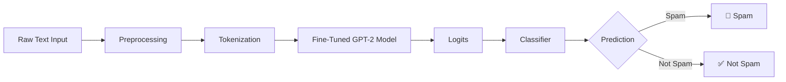
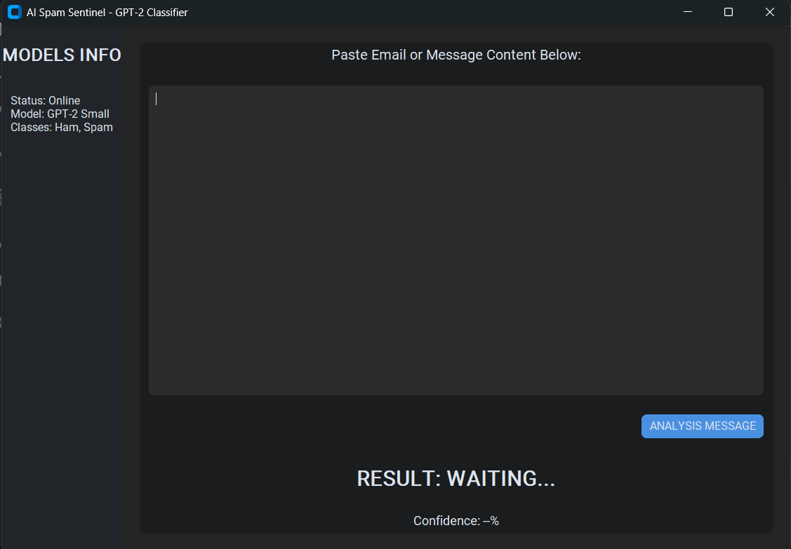
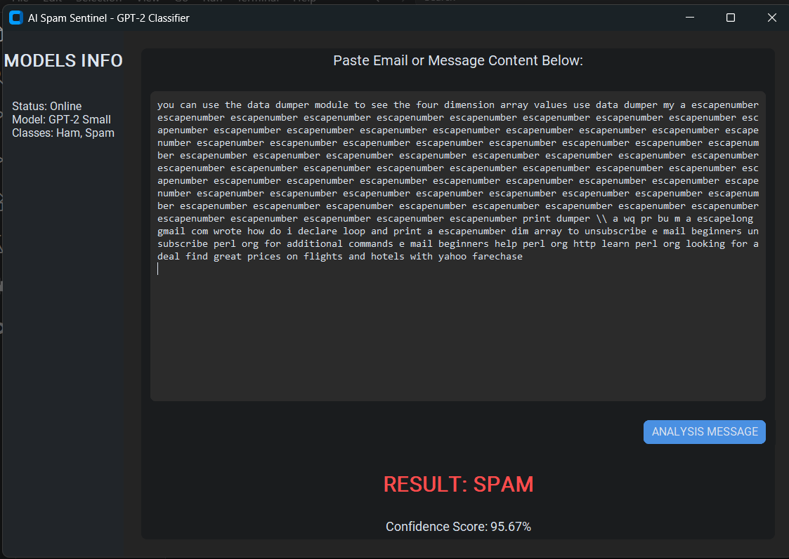
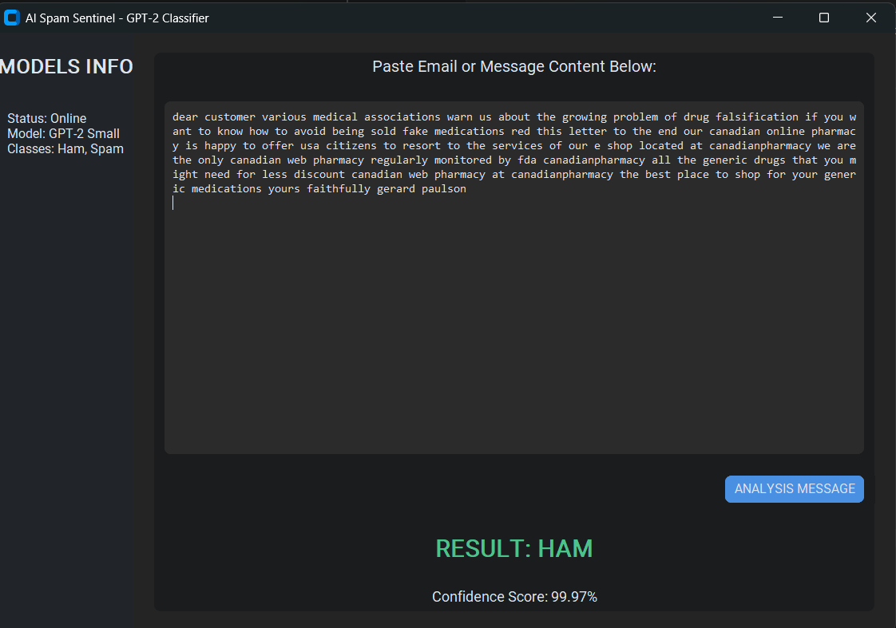

# 🚀 GPT-2 Spam Classifier (Fine-Tuned & Deployed)


An end-to-end Machine Learning project that fine-tunes a GPT-2 model and deploys it as a **Spam Detection Application**.

---

## 📌 Project Overview

* 🎯 Detect spam messages (Spam vs Not Spam)
* 🧠 Fine-tuned GPT-2 model
* 🔁 Transfer Learning approach
* 🖥️ Deployed as a standalone app

---

## 🧠 System Architecture



---

## 🏗️ Repository Structure

```
├── spam classifier app/
|   ├── Spam_GUI.py
|   ├── classify.py
|   ├── GPT2_Archeticture.py
│   └── Transformer_block.py
│   └── Attention.py
|    
├── data/
│   └── validation.csv
|   └── train.csv
|   └── test.csv
│
├── notebooks/
│   └── classification_finetuning.ipynb
│
├── screenshots/
│   ├── app_ui.png
│   └── prediction_example.png (spam)
|   └── prediction_example1.png (ham)
│
├── requirements.txt
└── README.md
```

---

## 📸 Application Preview

### 🖥️ Main Interface



### 🔍 Prediction Example





---

## ⚙️ Installation

```bash
git clone https://github.com/your-username/gpt2-spam-classifier.git
cd gpt2-spam-classifier
pip install -r requirements.txt
```

---

## 🚀 Run the App

```bash
python app/Spam_GUI.py
```

---

## 🧪 Example

**Input:**

```
Win a free vacation now!!! Click here!
```

**Output:**

```
Spam 🚨
```

---

## 📊 Model Details

* GPT-2 Fine-Tuned for Classification
* Hugging Face Transformers
* PyTorch backend
* Cross Entropy Loss

### 📈 Metrics

* Accuracy
* Precision
* Recall
* F1-score

---

## 🔍 Key Features

* ✅ GPT-2 adapted for classification
* ✅ End-to-end ML pipeline
* ✅ Real-time predictions
* ✅ Clean & modular structure


## 👤 Author

**Mohamed**

Machine Learning Engineer | NLP Enthusiast

---
