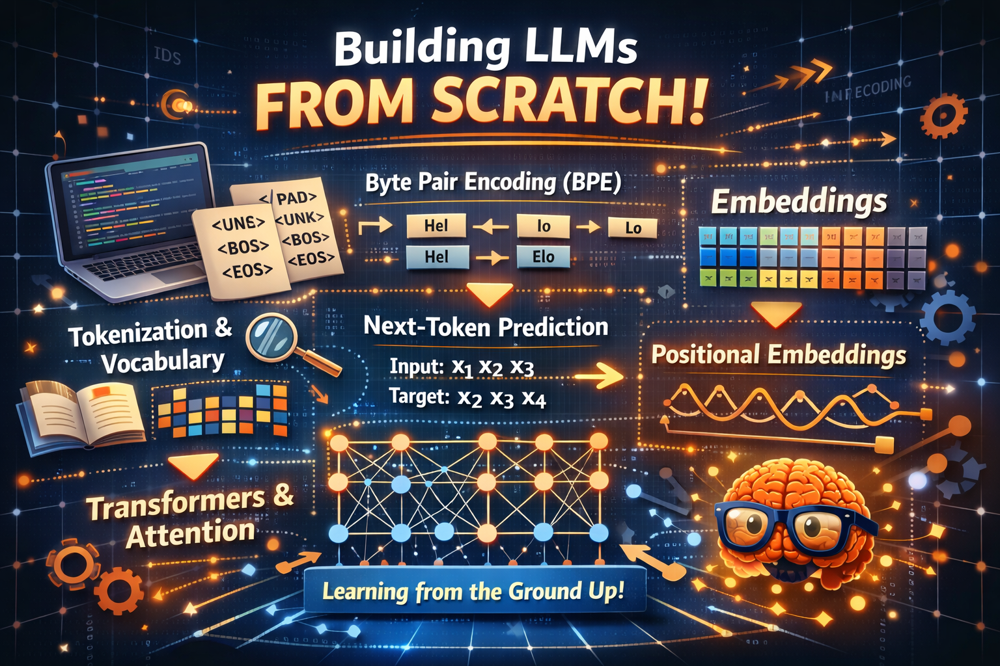
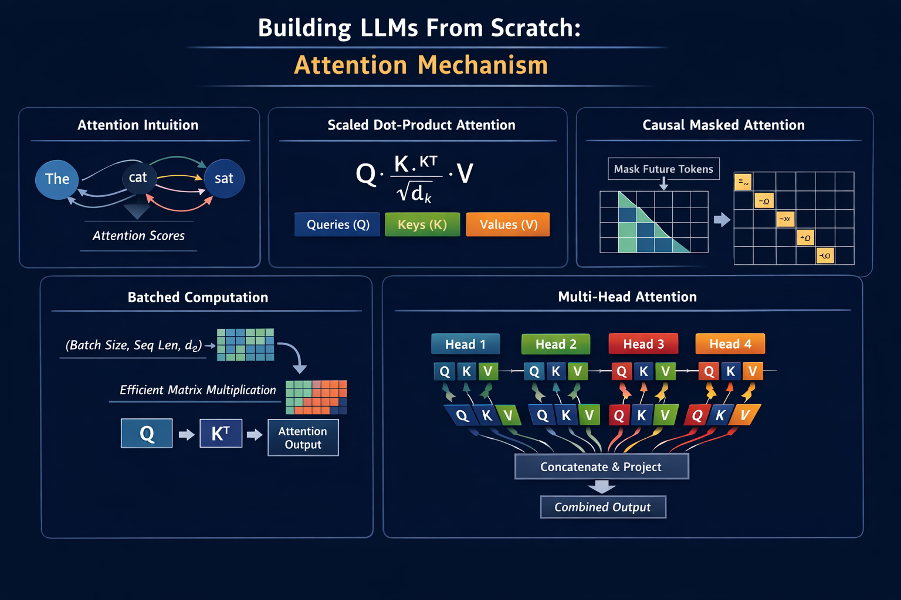
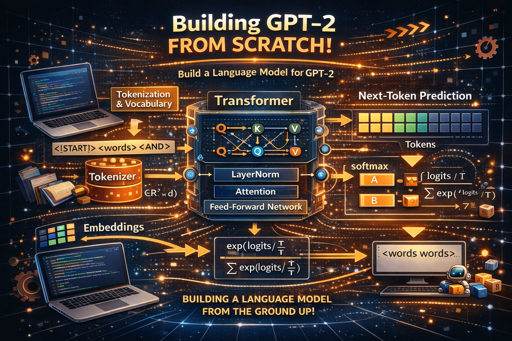
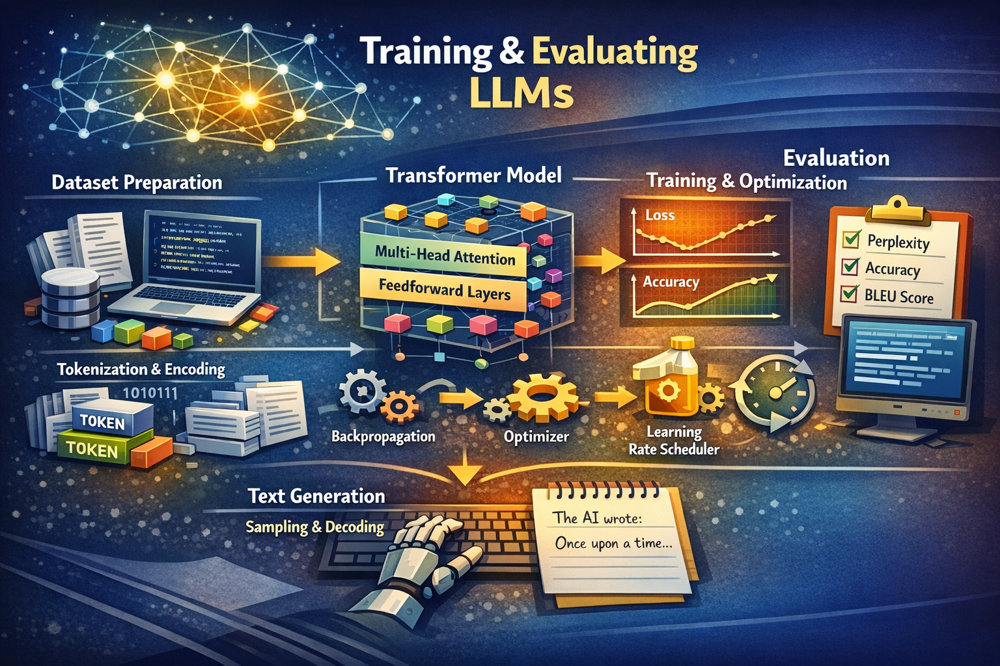
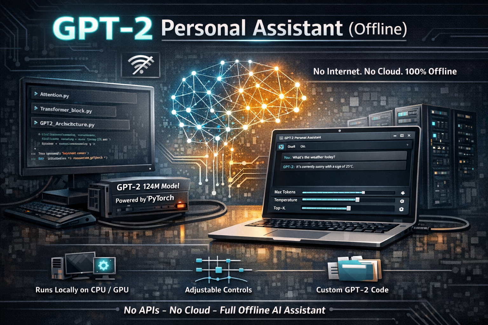

# LLM-from-scratch
building all stages of  LLM from scratch
## Part 1 : Tokenization&Embedding 

## Part 2 : Attention Mechanism 

## Part 3 : GPT Architecture Implementation

## Part 4 : Training & Evaluating LLMs 

## GPT_APP_From_P1_to_P4
### Combine all four parts into a single project that runs on your local machine

 

