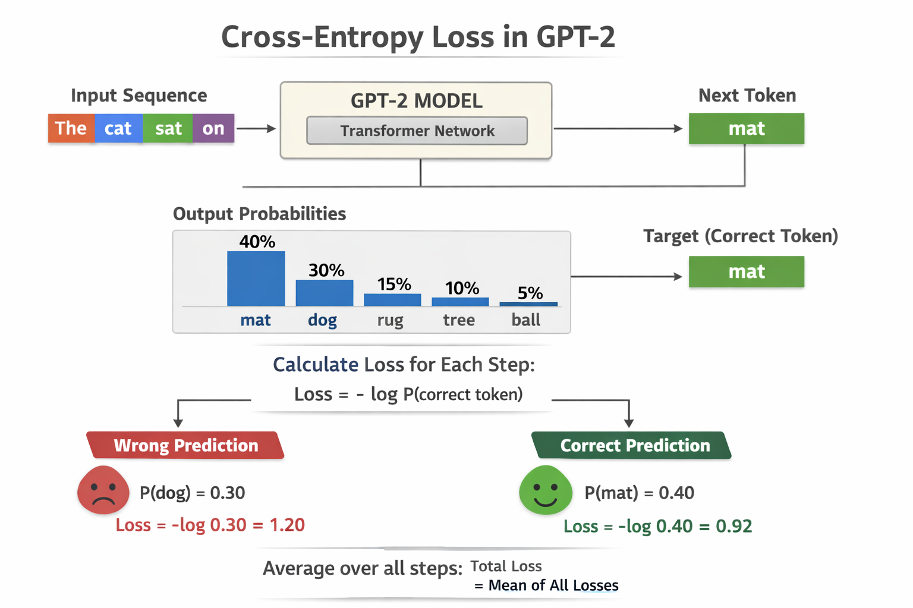

# part 4 : Training & Evaluating LLMs 

## Purpose
This notebook demonstrates an **end-to-end pipeline for training, evaluating, and generating text with a GPT-style Large Language Model (LLM)**. It focuses on the **essential components only**: data → model → training → evaluation → generation.

---

## What this notebook covers (important parts only)

### 1) Dataset Preparation
- Load raw text data.
- Split into **train / validation** sets.
- Prepare sequences for autoregressive (next-token) prediction.

**Concept:** The model always predicts the *next token* given previous context.

---

### 2) Tokenization & Encoding
- Convert raw text into token IDs using a tokenizer.
- Build fixed-length context windows.
- Create PyTorch `Dataset` and `DataLoader` objects.

**Why it matters:** Tokenization defines the model’s vocabulary and directly affects performance and memory usage.

---

### 3) Transformer (GPT-style) Model
Core building blocks implemented from scratch:
- **Token & positional embeddings**
- **Causal multi-head self-attention** (no future token leakage)
- **Feedforward (MLP) layers**
- **Residual connections + LayerNorm**

These blocks are stacked to form a **decoder-only Transformer (GPT)**.

---

### 4) Training Loop
For each batch:
1. Forward pass → logits
2. Compute **cross-entropy loss**
3. Backpropagation
4. Optimizer step
5. (Optional) Learning rate scheduler step

Tracked metrics:
- Training loss
- Validation loss

---

### 5) Evaluation
- **Perplexity** (derived from loss)
- **Accuracy** (next-token prediction, sanity check)
- Optional BLEU or benchmark-style metrics

**Goal:** Measure how well the model generalizes to unseen text.

---

### 6) Text Generation
- Autoregressive decoding (token by token)
- Sampling techniques implemented in the notebook:
  - **Greedy decoding**: always picks the most probable next token
  - **Temperature scaling**: controls randomness in generation
  - **Top-k sampling**: limits choices to the k most probable tokens

**Temperature (T):**
- Low T (< 1.0) → safer, more deterministic text
- High T (> 1.0) → more creative, more randomness

**Top-k:**
- Restricts sampling to the top-k probable tokens
- Prevents low-probability, nonsensical outputs

These techniques allow balancing **coherence vs creativity**.

Example output:
> *“Once upon a time …”*

This shows the model learned statistical patterns from training data.

---

## Loading Pretrained GPT-2 Weights (OpenAI)
This notebook also supports **loading official GPT-2 pretrained weights released by OpenAI**.

### How it works
- Uses the provided `GPT_downloader.py` utility
- Downloads original TensorFlow checkpoints from OpenAI’s public storage
- Converts and maps them into the custom PyTorch GPT implementation

Supported model sizes:
- 124M
- 355M
- 774M
- 1558M

This allows:
- Verifying correctness of the custom GPT implementation
- Starting from pretrained weights instead of training from scratch
- Comparing scratch training vs pretrained fine-tuning

---

## Outputs produced
- Model checkpoints
- Training & validation loss plots
- Generated text samples

---

## How this relates to the previous notebook
This notebook **builds directly on the previous GPT Architecture notebook**:
- Previous part → *How GPT works internally*
- This part → *How GPT is trained, evaluated, and used*

Together, they form a complete **LLM-from-scratch learning pipeline**.

---

## Educational note
This project is designed for **learning and experimentation**, not large-scale production training. Simplicity and clarity are prioritized over maximum performance.

